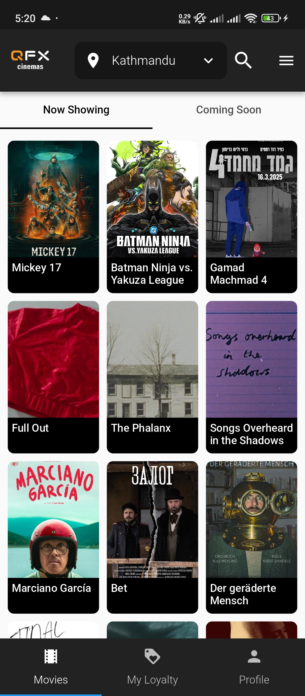
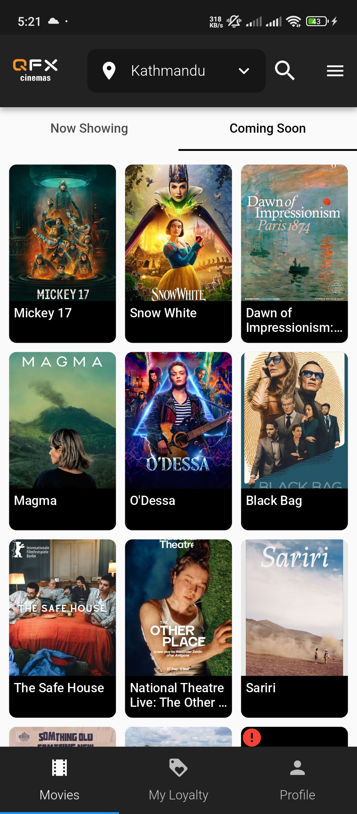

# QFX App - Flutter

QFX is a Flutter-based app that uses REST API and GetX state management.

## Screenshots






## Features

- Now Screening Movies  
- Upcoming Movies  
- Search Movies  

## Getting Started

To run this project locally, follow these steps:

### Installation

1. Clone this repository:

   ```sh
   git clone https://github.com/rojanparajuli/qfx.git
   cd qfx
